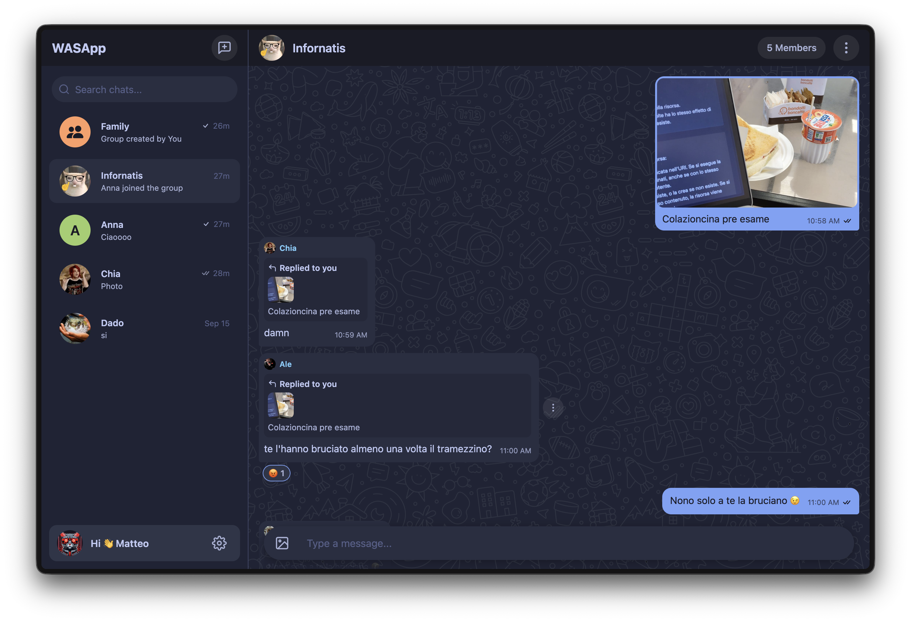
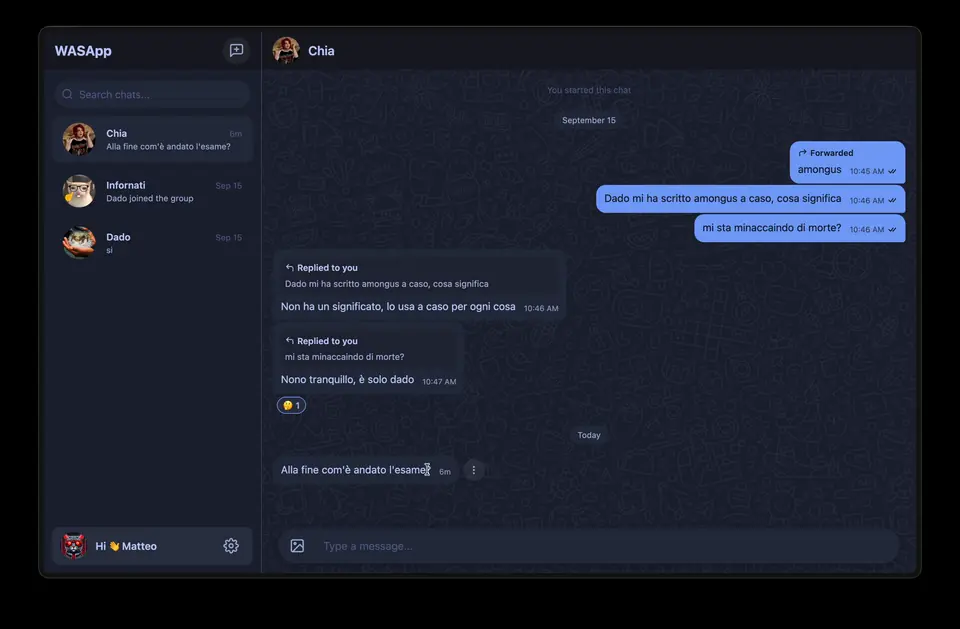
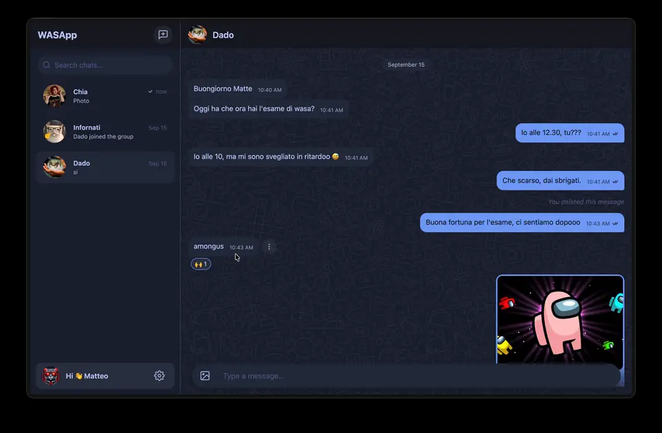
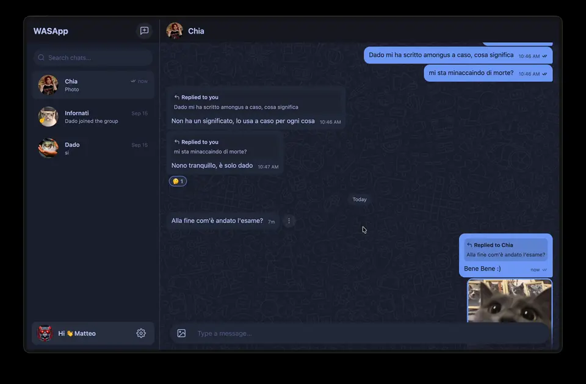
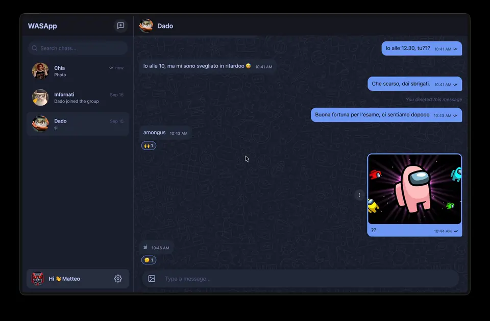
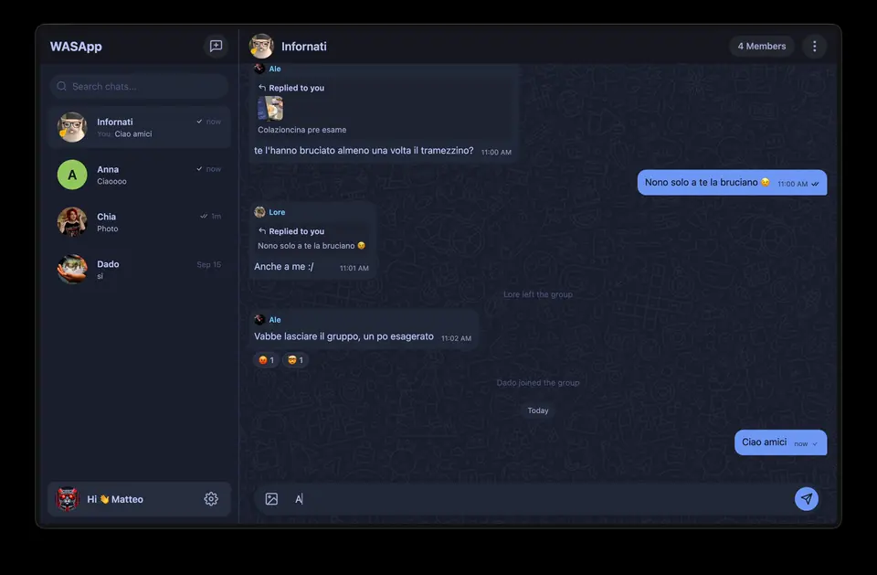
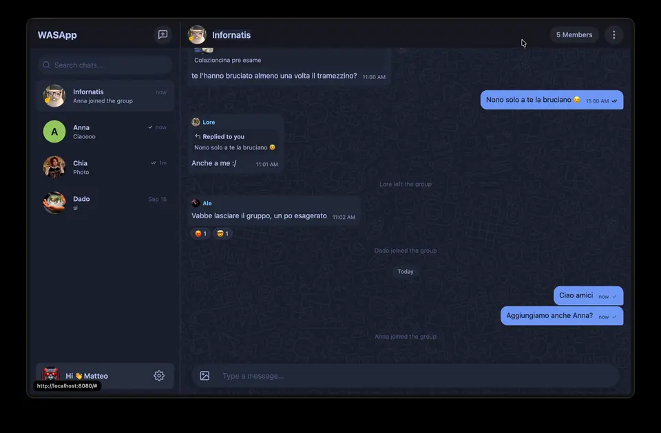

# WASApp

A full-stack messaging web application built as the final project for the **Web and Software Architecture (WASA)** course at **Sapienza University of Rome** (academic year 2025/2026).



## Features

- **Authentication**: Simplified bearer token authentication (no passwords)
- **User profile**: create, rename, set and remove avatar
- **Direct and group chats**: create, rename, change avatar, add/remove members, leave
- **Rich Messaging**: Send text messages, images, reply to messages, forward messages
- **Reactions**: React to messages with emojis
- **Read Receipts**: Single checkmark (delivered), double checkmark (received), colored double checkmark (read)
- **Custom UI** based on the TokyoNight color scheme

## Tech stack

- **Backend:** Go 1.25, [httprouter](https://github.com/julienschmidt/httprouter), SQLite
- **Frontend:** Vue 3, Vite, Vue Router, Axios, Bootstrap 5 with a custom TokyoNight theme
- **Icons:** Feather (SVG sprite) and Bootstrap Icons
- **API:** REST, OpenAPI 3 specification in [`doc/api.yaml`](doc/api.yaml)
- **Packaging:** Docker and Docker Compose

## How it was built

The project follows an **API-first** approach following this implementation order:

1. **API contract** — the endpoints are defined first in the OpenAPI specification [`doc/api.yaml`](doc/api.yaml).
2. **Database design** — modelled and then restructured for a cleaner implementation ([original](doc/db_schema_original.png) → [restructured](doc/db_schema_restructured.png)).
3. **Backend** — implemented in Go on top of the course template.
4. **Frontend** — a Vue 3 single-page app with a custom theme.
5. **Packaging** — both services are containerized and executed with Docker Compose.

## Getting started

### With Docker Compose (recommended)

```shell
docker compose up --build
```

- API → http://localhost:3000
- Web app → http://localhost:8080

Signing in with a username creates the account automatically if it does not exist.

### Without Docker

Backend:

```shell
go build -o webapi ./cmd/webapi
./webapi            # listens on :3000
```

Frontend:

```shell
cd webui
yarn run dev        # dev server on http://localhost:5173
# or build the production bundle
yarn run build-prod
```

## Simplified Project structure

```
wasapp/
├── cmd/webapi				# application entry point
├── demo/config.yml         # default configuration (port, DB path, uploads dir)
├── doc/
│   ├── api.yaml            # OpenAPI 3 specification
│   ├── db_schema_original.png
│   └── db_schema_restructured.png
├── service/
│   ├── api/                # one file per HTTP endpoint + shared helpers
│   │   └── reqcontext/     # per-request context (authentication, logger)
│   ├── database/           # SQLite queries, one file per entity
│   └── globaltime/         # server-assigned timestamps
├── webui/
│   ├── public/             # static assets (Bootstrap, Feather sprite, background)
│   └── src/
│       ├── assets/         # global styles and theme
│       ├── components/     # reusable Vue components (ui/ holds the primitives)
│       ├── composables/    # shared state (useUsers, useChats, usePolling)
│       ├── router/
│       ├── services/       # axios instance, auth, API helpers, validators
│       ├── views/          # routed pages
│       ├── App.vue
│       └── main.js
├── Dockerfile.backend
├── Dockerfile.frontend
├── docker-compose.yml
├── go.mod
└── LICENSE
```

## Frames

<table>
  <tr>
    <td align="center"><br><sub>Send a message</sub></td>
    <td align="center"><br><sub>Emoji reactions</sub></td>
  </tr>
  <tr>
    <td align="center"><br><sub>Forward message</sub></td>
    <td align="center"><br><sub>Delete message</sub></td>
  </tr>
  <tr>
    <td align="center"><br><sub>Add member</sub></td>
    <td align="center"><br><sub>Leave / Create group</sub></td>
  </tr>
</table>

## Known limitations

- **No real authentication** — as required by the assignment, login only associates a username with a session token; there is no password or credential check.
- **No real-time push** — new messages are fetched by polling (every 10 seconds) rather than through WebSockets.
- A small university project, not hardened for production.

## License

Released under the MIT License — see [`LICENSE`](LICENSE). Built on the [Fantastic Coffee Decaffeinated](https://github.com/sapienzaapps/fantastic-coffee-decaffeinated) template provided by the course.

## AI use disclosure

I used AI tools as a study aid during this project. I designed the architecture and wrote the backend and the API myself, using AI mainly as a mentor to reason through problems and to help with testing. For the frontend I put the component structure together, but the CSS and visual details were refined with AI: it's the area I'm least experienced in, and one I don't intend to pursue professionally.
